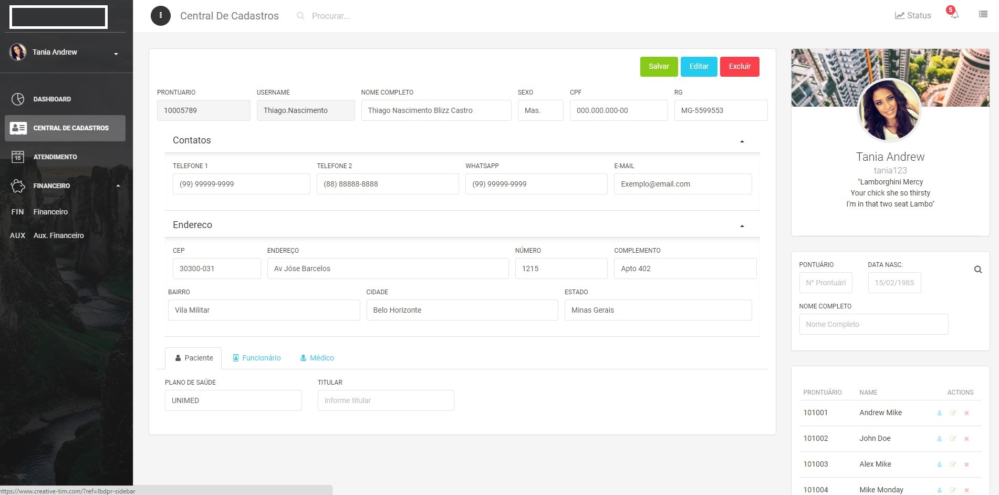

# blizz versao 0.1



Cadastro, agenda, financeiro, relatorios

## Estrutura dos arquivos

```
.
├── README.md
├── public
│   ├── apple-icon.png
│   ├── favicon.png
│   ├── index.html
│   └── manifest.json
│
└── src
    ├── index.js
    ├── logo.svg
    ├── routes.js
    ├── assets
    │   ├── css
    │   │   ├── demo.css
    │   │   ├── light-bootstrap-dashboard-pro-react.css
    │   │   ├── light-bootstrap-dashboard-pro-react.css.map
    │   │   ├── light-bootstrap-dashboard-pro-react.min.css
    │   │   └── pe-icon-7-stroke.css
    │   ├── fonts
    │   ├── img
    │   │   ├── faces
    │   │   ├── flags
    │   └── sass
    │       ├── lbd
    │       │   ├── mixins
    │       │   └── plugins
    │       └── light-bootstrap-dashboard-pro-react.scss
    │
    ├── components
    │   ├── Card
    │   │   ├── Card.jsx
    │   │   ├── MapCard.jsx
    │   │   ├── StatsCard.jsx
    │   │   └── UserCard.jsx
    │   ├── CustomButton
    │   │   └── CustomButton.jsx
    │   ├── CustomCheckbox
    │   │   └── CustomCheckbox.jsx
    │   ├── CustomRadio
    │   │   └── CustomRadio.jsx
    │   ├── FixedPlugin
    │   │   └── FixedPlugin.jsx
    │   ├── Footer
    │   │   └── Footer.jsx
    │   ├── FormInputs
    │   │   └── FormInputs.jsx
    │   ├── Navbars
    │   │   ├── AdminNavbar.jsx
    │   │   ├── AdminNavbarLinks.jsx
    │   │   └── AuthNavbar.jsx
    │   ├── Sidebar
    │   │   └── Sidebar.jsx
    │   └── Tasks
    │       └── Tasks.jsx
    │
    ├── layouts
    │   ├── Admin.jsx
    │   └── Auth.jsx
    │
    ├── variables
    │   ├── Variables.jsx
    │   ├── chartsVariables.jsx
    │   └── faVariables.jsx
    │
    └── views
        ├── Cent_Cadastros.jsx
        └── Dashboard.jsx

```
